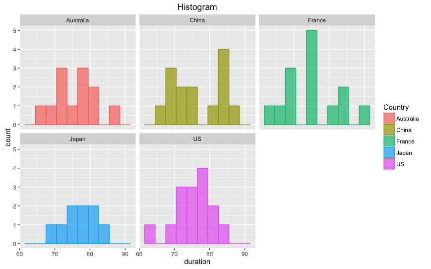
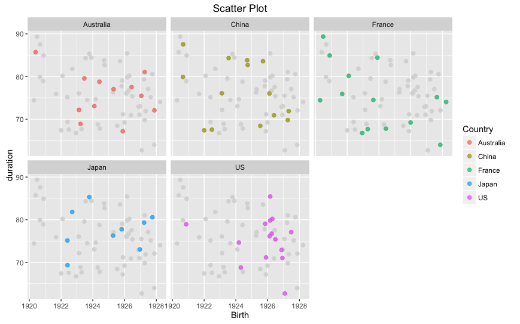

```{r, echo = FALSE}
knitr::opts_chunk$set(
  collapse = TRUE,
  comment = "#>",
  fig.path = "README-"
)
```
# timelineS
> An easy tool for visualizing, annotating, and stratifying time series data.

This package contains five functions as below.

* `timelineS`: Plots a horizontal timeline with event descriptions at corresponding dates.\
* `timelineG`: Plots faceted timelines for grouped data.\
* `durPlot`: Plots boxplot, histogram, density plot, scatter plot, line plot and prints summary statistics for date duration data.\
* `durCalc`: Calculates the duration between two dates, use it as a filter to select rows that satisfy the length criteria. Returns the dataset with additional columns regarding the length of durations in different units.\
* `durSummary`: Returns summary statistics for date duration data.


## Installing the latest version

```sh
devtools::install_github("daheelee/timelineS")
```

## Usage example

###timelineS
`timelineS` plots an annotated timeline. 
```sh
timelineS(mj_life, main = "Life of Michael Jackson")
```


You can also change the aesthetics.
```sh
timelineS(mj_life, main = "Life of Michael Jackson", 
label.direction = "up", label.length = c(0.2,0.8,0.4,1.2), label.position = 3, 
line.color = "blue", label.color = "blue", point.color = "blue", pch = "-")
```


###timelineG
`timelineG` creates stacked timelines, faceted by groups.
```sh
timelineG(df=life_country, start="Start", end="End", names="Name", 
phase="Phase", group1="Country", group2="Gender")
```


###durPlot
`durPlot` function gives five different plots by default. You can set `facet=TRUE` to get faceted plots.
```sh
durPlot(life_exp, start="Birth", end="Death", group="Country", timeunit="years", facet=TRUE, binwidth=3, alpha=0.7, title=TRUE)
```




`durPlot` also gives a summary of the duration lengths with the plots. 

###durSummary
`durSummary` is a simpler function if you only want the summary.
```sh
durSummary(life_exp, start="Birth", end="Death", group="Country", timeunit="years")
```

```sh
    Country   min   Qt1 median  mean   Qt3   max   sd
1 Australia 67.19 72.16  76.26 75.72 78.98 85.71 5.30
2     China 67.41 70.09  76.06 76.44 83.38 87.56 7.14
3    France 64.02 68.16  74.48 74.89 79.10 89.37 7.59
4     Japan 69.35 75.14  77.76 77.63 80.57 85.33 4.82
5        US 62.73 72.04  76.21 75.35 79.00 85.45 5.49
```

###durCalc
`durCalc` filters a data frame using duration lengths. Let's say we have a dataset that has dates of birth and death of people.
We can filter out people(rows) who lived longer than 85 years. You can also do `filterlonger=FALSE` to select rows that are shorter than some time length.
```sh
durCalc(life_exp, start="Birth", end="Death", timeunit="years", filterlength=85)
```
The output has a few extra duration information in specified `timeunit` and also in calendar units.
```sh
     Name   Country Gender      Birth      Death  days diff_years            diff_length             longer_by
8   Susan Australia Female 1920-05-26 2006-02-10 31306      85.71 85years 8months 16days        8months 16days
19    Mai     Japan Female 1923-10-12 2009-02-07 31165      85.33 85years 3months 27days        3months 27days
24    Leo    France   Male 1920-06-28 2009-11-09 32641      89.37 89years 4months 12days 4years 4months 12days
48 Gloria        US Female 1926-03-01 2011-08-14 31212      85.45 85years 5months 14days        5months 14days
60   Ming     China Female 1920-09-06 2008-03-31 31983      87.56 87years 6months 24days 2years 6months 24days
```
If you want to know how old each person would be as of January 1, 2000, you can do:
```sh
durCalc(life_exp, start="Birth", end=as.Date("2000-1-1"), timeunit="years")
```
```sh
      Name   Country Gender      Birth      Death  days             diff_length
1    Edward Australia   Male 1927-11-17 1999-12-16 26343   72years 1month 15days
2     James Australia   Male 1925-11-20 1993-01-27 27070   74years 1month 11days
3      Mark Australia   Male 1926-06-11 2003-12-26 26867  73years 6months 21days
4      Fred Australia   Male 1927-01-22 2002-07-19 26642  72years 11months 9days
5      Phil Australia   Male 1923-06-20 2003-01-15 27954  76years 6months 12days
...
```
Or you can simply use this as a unit-converter between two dates.
```sh
durCalc(start=as.Date("2010-12-1"), end=as.Date("2015-4-26"), timeunit="weeks")
```
```sh
 days diff_weeks           diff_length
1 1607     229.57 4years 4months 24days
```
## Release History

* 0.1.0
    * First upload


## Meta

Dahee Lee – dhlee99@gmail.com

Distributed under the GPL-2 license. 

[https://github.com/daheelee/timelineS](https://github.com/daheelee/)

[npm-image]: https://img.shields.io/npm/v/datadog-metrics.svg?style=flat-square
[npm-url]: https://npmjs.org/package/datadog-metrics
[npm-downloads]: https://img.shields.io/npm/dm/datadog-metrics.svg?style=flat-square
[travis-image]: https://img.shields.io/travis/dbader/node-datadog-metrics/master.svg?style=flat-square
[travis-url]: https://travis-ci.org/dbader/node-datadog-metrics

